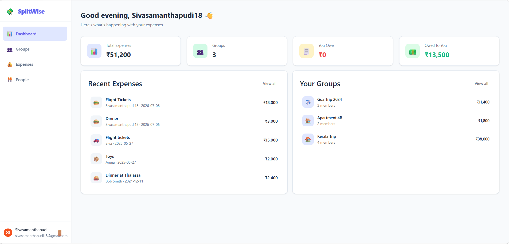
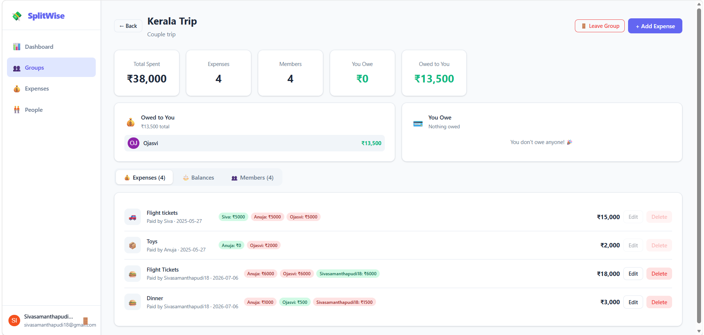
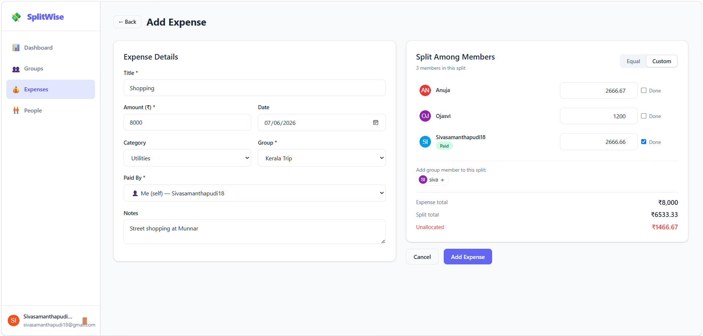

# 💰 Expense Manager

A simple and efficient **Expense Management Web Application** built using **Angular** (and supporting modern frontend practices). This app helps users track income, expenses, and maintain better financial discipline with a clean UI and intuitive workflow.

---

## 🚀 Features

* ➕ Add expenses
* 📊 View groups, members, total balances, and expense summary
* 🧾 Transaction history tracking
* 🗂️ Categorize transactions
* 🔍 Filter and review past transactions
* 💾 Local storage / persistent data support
* 📱 Responsive UI for mobile and desktop

---

## 🛠️ Tech Stack

* **Frontend:** Reactjs / TypeScript
* **Styling:** HTML, CSS, Bootstrap
* **State Management:** Context / Services (if used)
* **Storage:** Local Storage / API (based on implementation)

---

## 📂 Project Structure

```
expense-manager/
│
├── src/
│   ├── app/
│   │   ├── components/       # UI components
│   │   ├── services/         # Business logic & data handling
│   │   ├── models/           # Interfaces & types
│   │   └── pages/            # Application pages
│   │
│   ├── assets/
│   └── environments/
│
├── package.json
└── README.md
```

---

## ⚙️ Installation & Setup

### 1. Clone the repository

```bash
git clone https://github.com/SivaSamanthapudi/expense-manager.git
cd expense-manager
```

### 2. Install dependencies

```bash
npm install
```

### 3. Run the application

```bash
npm run start
```

### 4. Open in browser

```
http://localhost:3000
```

---

## 📦 Build for Production

```bash
npm run build --configuration production
```

The build artifacts will be stored in the `dist/` folder.

---

## 🎯 Usage

1. Add your expenses
2. Track your financial balance in real-time
3. Review transaction history
4. Analyze spending patterns

---

## 📸 Screenshots
Home Page – Dashboard view


Groups – view



Add Expense - Form screen



## 🤝 Contribution

Contributions are welcome!

1. Fork the repo
2. Create a new branch (`feature/new-feature`)
3. Commit changes
4. Push and create a Pull Request

---

## 📄 License

This project is open-source and available under the **MIT License**.

---

## 👨‍💻 Author

**Siva Samanthapudi**
GitHub: [@SivaSamanthapudi](https://github.com/SivaSamanthapudi)

